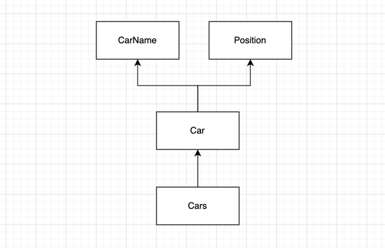

# 도메인 구조

- `Cars` : `List<Car>` 를 가지고 있는 일급 컬렉션으로 자동차 이름들을 관리
- `Car` : 인스턴스 변수로 `CarName` , `Position` 을 가지고 있으며 자동차의 역할을 한다.
- `CarName` : `String` 으로 자동차 이름을 가지고 있다. 자동차 이름에 대한 검증을 관리한다.
- `Position` : `int` 로 자동차 위치 정보를 가지고 있다. 위치에 대한 검증을 관리한다.

# 기능 구현 목록
## 게임 초기화
- [X] 경주할 자동차 이름을 입력 받는다.
  - [X] `예외처리` : 빈 값이 입력된 경우 
  - [X] `예외처리` : 쉼표로 구분되지 않은 경우
  - [X] `예외처리` : 이름이 5자를 초과하는 경우
  - [X] `예외처리` : (내가 추가한 예외) 이름이 1자 미만인 경우
- [X] 시도할 회수를 입력 받는다.
  - [X] `예외처리` : 빈 값이 입력된 경우
  - [X] `예외처리` : 숫자가 아닌 경우
  - [X] `예외처리` : 음수인 경우

## 게임 진행
- [X] 입력된 회수만큼 이동한다.
  - [X] 0 ~ 9 사이 무작위 숫자를 뽑는다.
  - [X] 4 이상일 경우 전진 시킨다.
  - [X] 3 이하일 경우 아무 동작을 하지 않는다.
- [X] 실행 결과를 출력한다.
  - [X] 맨 처음 출력시 `실행 결과` 를 출력한다.
  - [X] `${이름} : ---` 와 같은 형식으로 출력한다.
  - [X] 이동 문자는 `-` 로 한다.
  - [X] 이름이 입력된 순서대로 실행 결과를 출력한다.

## 게임 종료
- [X] 우승자를 출력한다.
  - [X] `최종 우승자 : ${이름}` 형태로 출력한다.
  - [X] 우승자가 여러 명일 경우 쉼표와 띄어쓰기를 이용해 구분한다.(ex : `최종 우승자 : pobi, jun`)

## 추가 체크 목록
- [X] 예외 발생시 `IllegalArgumentException` 예외를 출력하고 프로그램을 종료한다.
- [X] 인덴트는 3을 넘지 않도록 구현한다.
- [X] 3항 연산자를 사용하지 않는다.
- [X] 테스트 코드를 구현한다.
- [X] 랜덤 값 추출은 `pickNumberInRange` 를 활용한다.

## 피드백 체크리스트
- [X] PR 보내기 전 브랜치를 확인한다.
- [X] 변수나 메서드는 이름을 통해 의도를 드러냈다.
- [X] 이름을 축약하지 않는다.
- [X] 공백 컨벤션을 지켰다.
- [X] 의미 없는 주석을 달지 않았다.
- [X] IDE 코드 자동 정렬 기능을 사용했다.
- [X] 배열 대신 컬렉션을 사용했다.

# 설계 구조
- MainController : 데이터 전달 및 중계 역할
- RacingService : 레이싱과 관련된 비즈니스 로직 관리
- InputView : 입력과 관련된 책임 관리
- OutputView : 출력과 관련된 책임 관리
- GameData : 개임을 진행하는데 필요한 데이터를 관리
  - RacerList : 레이싱 리스트 관련 메서드 및 데이터 관리
  - Racer : 레이싱 선수와 관련된 메서드 및 데이터 관리

# 확장 가능성
- [X] 승리 조건의 변경 (특정 위치까지 먼저 도달한 자동차가 승리)
- [X] 자동차마다 속도가 있도록 변경 (한번 움직이는 거리가 자동차마다 달라지는 경우)